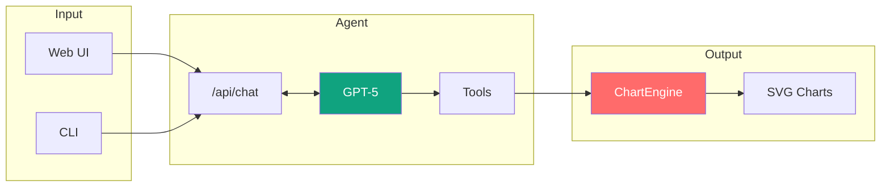

# Chart Agent MVP

Een AI-gestuurde grafiek-generatie agent voor FD Mediagroep die staaf- en lijngrafieken maakt in FD- of BNR-kleuren.

## Functies

| Feature | Beschrijving |
|---------|-------------|
| Staaf- en lijngrafieken | Genereer professionele grafieken |
| FD- en BNR-kleuren | Huisstijl ondersteuning |
| CLI en Web interface | Flexibele interactie |
| Excel import | Upload .xlsx/.xls bestanden |
| Sessie geheugen | Onthoudt kleurvoorkeuren |
| Nederlandse taal | Volledig Nederlandstalig |

## Quick Start

```bash
# 1. Installeer dependencies
nvm use && npm install

# 2. Configureer environment
cp .env.local.example .env.local
# Voeg OPENAI_API_KEY toe aan .env.local

# 3. Start de applicatie
npm run dev      # Web interface op http://localhost:3000
npm run cli      # CLI interface
```

## Architectuur



### Flow

1. **Input** — Gebruiker stuurt bericht via Web of CLI (optioneel met Excel bestand)
2. **Agent** — GPT-5 analyseert het verzoek en roept de juiste tool aan
3. **Output** — ChartEngine genereert SVG in FD of BNR kleuren

## Gebruik

### Web Interface

```bash
npm run dev
```

Open `http://localhost:3000` — chat met de agent en upload Excel bestanden direct in de chat.

### CLI Interface

```bash
npm run cli
```

```
chart-agent> Maak een staafgrafiek: Q1=100, Q2=150, Q3=175, Q4=200
chart-agent> test-data/ov-checkins.xlsx
chart-agent> /exit
```

## Project Structuur

```
src/
├── app/
│   ├── api/chat/         # Chat API endpoint
│   └── page.tsx          # Web interface
├── features/
│   ├── agent/            # Agent core, tools, prompts
│   ├── charts/           # ChartEngine + brand colors
│   ├── parsers/          # Excel parser
│   └── ui/               # React components
├── cli/                  # CLI entry point
└── evals/                # Evaluatie tests
```

## Brand Kleuren

| Brand | Primary | Content | Background |
|-------|---------|---------|------------|
| **FD** | `#379596` | `#191919` | `#ffeadb` |
| **BNR** | `#ffd200` | `#000000` | `#ffffff` |

## Scripts

| Script | Beschrijving |
|--------|-------------|
| `npm run dev` | Start development server |
| `npm run cli` | Start CLI interface |
| `npm run build` | Production build |
| `npm run eval` | Run evaluatie suite |
| `npm run lint` | Run ESLint |

## Beperkingen

De agent is bewust beperkt tot:
- Alleen staaf- en lijngrafieken
- Alleen FD of BNR kleuren
- Weigert niet-grafiek gerelateerde verzoeken

## Tech Stack

- **Runtime:** Node.js 20.18.1
- **Framework:** Next.js 14
- **LLM:** OpenAI GPT-5
- **Agent:** Vercel AI SDK v5
- **Charts:** ECharts SSR

## Troubleshooting

| Probleem | Oplossing |
|----------|-----------|
| `OPENAI_API_KEY is not set` | Maak `.env.local` met geldige API key |
| `Cannot find module` | Run `npm install` |
| Node versie fout | Run `nvm use` |
| Charts niet gegenereerd | Check of `./public/charts` bestaat |

## Licentie

Proprietary - FD Mediagroep
