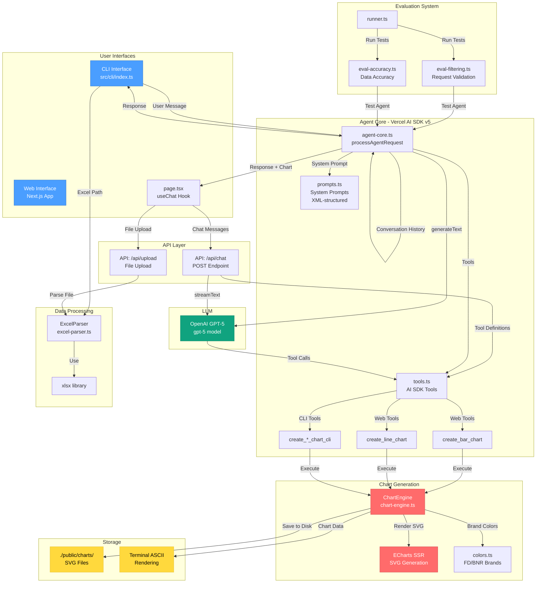

# Chart Agent MVP

Een AI-gestuurde grafiek-generatie agent voor FD Mediagroep die staaf- en lijngrafieken maakt in FD- of BNR-kleuren.

## Architectuur Diagram



### Architectuur Flow

**Web Interface:**
1. Gebruiker interacteert via Next.js web UI (`page.tsx`)
2. Chat messages → `/api/chat` → OpenAI GPT-5 (streaming)
3. Excel upload → `/api/upload` → ExcelParser → Gestructureerde data
4. GPT-5 roept AI SDK tools aan (`create_bar_chart` / `create_line_chart`)
5. ChartEngine genereert ECharts SVG → Opgeslagen in `./public/charts/`
6. SVG getoond in web UI

**CLI Interface:**
1. Gebruiker typt command of Excel pad in terminal
2. `processAgentRequest()` → OpenAI GPT-5
3. GPT-5 roept CLI-specifieke tools aan (`create_*_chart_cli`)
4. ChartEngine genereert chart data (niet opgeslagen)
5. ASCII grafiek gerenderd in terminal

**Kerncomponenten:**
- **Agent Core:** Vercel AI SDK v5 met `generateText()` / `streamText()`
- **Tools:** Strikte JSON schema's met `additionalProperties: false`
- **Prompts:** XML-gestructureerde system prompts voor duidelijke grenzen
- **ChartEngine:** ECharts SSR voor server-side SVG generatie
- **Evaluaties:** Geautomatiseerde tests voor filtering en data-accuracy

## Overzicht

De Chart Agent MVP is een gespecialiseerde AI-agent gebouwd met:
- **Runtime:** Node.js 24.11.0 (LTS)
- **Taal:** TypeScript
- **Web Framework:** Next.js 14 (App Router)
- **LLM:** OpenAI GPT-5
- **Agent Framework:** Vercel AI SDK v5
- **Grafieken:** D3.js (web) en d3-node (CLI)
- **Excel Verwerking:** xlsx library

## Functies

- ✅ **Staaf- en lijngrafieken** maken
- ✅ **FD- en BNR-kleuren** ondersteuning
- ✅ **CLI en Web interface**
- ✅ **Tekst en Excel input** verwerking
- ✅ **Sessie geheugen** voor voorkeuren
- ✅ **Automatische evaluaties**
- ✅ **Nederlandse taal** interacties

## Installatie

### Vereisten

- Node.js 20.18.1 (LTS) - gebruik nvm voor eenvoudige installatie
- npm of yarn
- OpenAI API key

### Stappen

1. Clone de repository:
```bash
git clone <repository-url>
cd chart-agent-mvp
```

2. Gebruik de juiste Node versie (met nvm):
```bash
nvm use
# Of als je Node 20.18.1 nog niet hebt:
nvm install
```

3. Installeer dependencies:
```bash
npm install
```

3. Maak een `.env.local` bestand:
```bash
cp .env.local.example .env.local
```

4. Voeg je OpenAI API key toe aan `.env.local`:
```env
OPENAI_API_KEY=sk-your-api-key-here
```

## Gebruik

### CLI Interface

Start de CLI:
```bash
npm run cli
```

Voorbeelden:
```
chart-agent> Maak een staafgrafiek met verkoopcijfers: Q1=100, Q2=150, Q3=175, Q4=200

chart-agent> Geef me een lijngrafiek van de groei: Jan=10, Feb=15, Mrt=20

chart-agent> test-data/ov-checkins.xlsx

chart-agent> /exit
```

### Web Interface

Start de development server:
```bash
npm run dev
```

Open je browser op `http://localhost:3000`

Features:
- Chat interface voor interactie met de agent
- Excel bestand upload
- Live grafiek weergave
- Schakel tussen FD en BNR kleuren

### Production Build

```bash
npm run build
npm start
```

## Test Prompts

### Test Prompt 1: OV Check-ins
```
Geef me een grafiek met het aantal checkins per dag bij het OV:
Maandag = 4,1
Dinsdag = 4,2
Woensdag = 4,4
Donderdag = 4,7
Vrijdag = 4,2
Zaterdag = 2,3
Zondag = 1,7
De getallen zijn in miljoenen check-ins.
```

### Test Prompt 2: Studieschuld
```
Ik wil een grafiek die aangeeft hoeveel miljard studieschuld studenten hebben in de laatste jaren. De waarden zijn: 2020 = 25, 2021 = 26, 2022 = 26.5, 2023 = 27.3, 2024 = 27.9, en 2025 = 29.
```

## Evaluaties

Run de evaluatie suite:
```bash
npm run eval
```

Dit voert twee evaluaties uit:
1. **Request Filtering:** Test of de agent correct chart-verzoeken accepteert en niet-chart verzoeken weigert
2. **Data Accuracy:** Test of de agent data correct verwerkt en grafieken maakt

Resultaten worden opgeslagen in `./eval-results/`

## Project Structuur

```
src/
├── app/                      # Next.js App Router
│   ├── api/                  # API routes
│   │   ├── chat/            # Chat endpoint
│   │   └── upload/          # File upload endpoint
│   ├── page.tsx             # Main page
│   ├── layout.tsx           # Root layout
│   └── globals.css          # Global styles
├── features/
│   ├── agent/               # Agent feature
│   │   ├── agent-core.ts    # Core agent logic
│   │   ├── tools.ts         # AI SDK tools
│   │   └── prompts.ts       # System prompts
│   ├── charts/              # Chart generation
│   │   ├── chart-engine.ts  # D3 chart engine
│   │   └── colors.ts        # Brand colors
│   ├── parsers/             # Input parsing
│   │   └── excel-parser.ts  # Excel parser
│   └── ui/                  # UI components
│       ├── ChatInterface.tsx
│       ├── ChartDisplay.tsx
│       └── FileUpload.tsx
├── cli/
│   └── index.ts             # CLI entry point
├── evals/
│   ├── eval-filtering.ts    # Filtering eval
│   ├── eval-accuracy.ts     # Accuracy eval
│   └── runner.ts            # Eval runner
└── lib/
    ├── types.ts             # TypeScript types
    └── utils.ts             # Utilities
```

## Kleuren

### FD Kleuren
- Primary: `#379596`
- Content: `#191919`
- Background: `#ffeadb`

### BNR Kleuren
- Primary: `#ffd200`
- Content: `#000`
- Background: `#fff`

## Beperkingen

De agent kan **alleen**:
- Staafgrafieken maken
- Lijngrafieken maken
- FD of BNR kleuren gebruiken

De agent **weigert**:
- Andere grafiektypen (taart, scatter, etc.)
- Niet-grafiek gerelateerde vragen
- Algemene vragen

## Ontwikkeling

### Scripts

- `npm run cli` - Start CLI interface
- `npm run dev` - Start development server
- `npm run build` - Build voor productie
- `npm start` - Start productie server
- `npm run eval` - Run evaluaties
- `npm run lint` - Run ESLint

### Debugging

Logs worden getoond in de console. Voor de CLI, zie terminal output. Voor de web interface, check browser console en server logs.

## Troubleshooting

### "OPENAI_API_KEY is not set"
Zorg ervoor dat je `.env.local` bestand bestaat en een geldige API key bevat.

### "Cannot find module"
Run `npm install` om alle dependencies te installeren.

### Node versie problemen
Dit project vereist Node.js 20.18.1 (LTS). Gebruik `nvm use` om automatisch naar de juiste versie te schakelen. De `.nvmrc` file specificeert de vereiste versie.

### Charts worden niet gegenereerd
Check of de `./public/charts` directory bestaat en schrijfbaar is.

### Excel upload werkt niet
Zorg ervoor dat het bestand:
- Een .xlsx of .xls extensie heeft
- Kleiner is dan 10MB
- Minimaal 2 kolommen heeft (labels en waarden)

## Licentie

Proprietary - FD Mediagroep

## Contact

Voor vragen of problemen, neem contact op met het development team.
